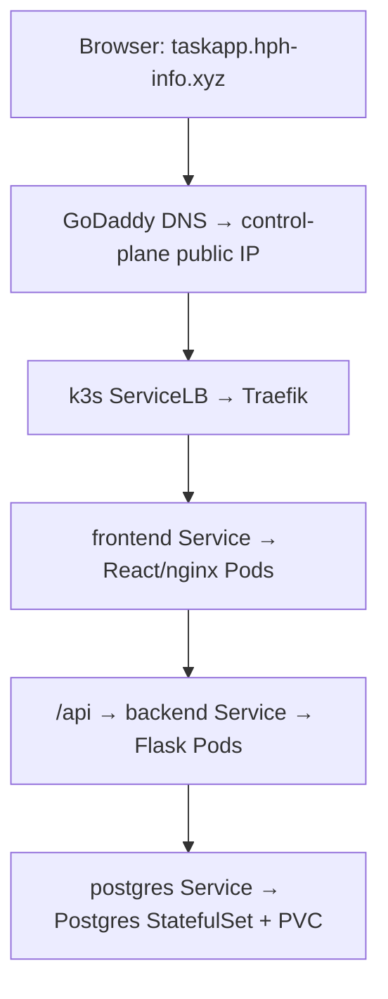

# TaskApp Architecture

## Infrastructure

Three Ubuntu 24.04 EC2 instances run k3s in AWS us-east-1a:

| Node | Instance type | Purpose |
|---|---|---|
| control-plane | t3.medium | Kubernetes control plane, Postgres and app workloads |
| worker-1 | t3.small | Application workloads |
| worker-2 | t3.small | Application workloads |

Terraform provisions networking, security groups and EC2 instances.
State is stored in encrypted, versioned S3 with DynamoDB locking.
Ansible roles configure the operating system, security and k3s.

## Request flow

Traefik terminates HTTPS using a Let's Encrypt certificate managed by
cert-manager. The frontend proxies /api to backend:5000, keeping both
under one hostname. Postgres is available internally on port 5432.

Frontend, backend and Traefik each have two replicas spread across nodes.
Postgres runs on the control plane with node-local persistent storage.

## Network and security

- VPC: 10.0.0.0/16; subnet: 10.0.1.0/24.
- Flannel connects Pods across nodes.
- Ports 80 and 443 are public; SSH is restricted to the administrator's IP.
- Kubernetes API and node-to-node ports are not publicly exposed.
- Laptop Kubernetes access uses an SSH tunnel.
- SSH uses a non-root account and keys; Ansible uses sudo.

## Core requirements

| Requirement | Single-server assumption addressed | Implementation |
|---|---|---|
| Namespace and configuration | Settings belong to one host | taskapp namespace, ConfigMap and Secret |
| Persistent database | Container storage survives replacement | Postgres StatefulSet and PVC |
| Multiple replicas | One process or machine is sufficient | Two frontend/backend replicas spread across nodes |
| Safe migrations | Every replica can migrate on startup | Separate migration Job; backend starts Gunicorn directly |
| Health probes | Running means ready to serve | Startup, readiness and liveness probes |
| Resource allocation | Workloads can freely share host resources | CPU/memory requests and limits |
| Rolling deployment | Updates require stopping the app | maxUnavailable: 0 and maxSurge: 1 |
| Public routing and TLS | Published host ports are enough | Traefik Ingress and cert-manager |
| Reproducible images | Image contents can change unnoticed | Explicit version or commit tags |

## GitOps and secrets

Argo CD automatically synchronizes manifests from the main branch of
https://github.com/Henestoe/capstone-project.git, with pruning and
self-healing enabled.

Application resources use raw YAML. Platform components use pinned Helm
charts. Ansible bootstraps Argo CD and registers its Applications.

Credentials are created out-of-band in taskapp-secrets. Secrets,
kubeconfigs, private keys and Terraform state are not committed.
metrics-server supplies CPU and memory readings.

## Evidence and limitations

Evidence in docs/EVIDENCE shows node readiness, Pod placement, database
persistence, TLS checks, resource metrics and worker-drain recovery.
The rollout log contains 782 successful request checks. The drain log
contains 17 successful checks, which do not prove uninterrupted service
throughout the entire drain.

This design survives a worker drain, but has one control plane, one
Postgres instance, one Availability Zone and one public entry-node IP.
The local-path PVC survives Pod deletion, not loss of its underlying disk.
A PVC is not a backup.

HPA and other distinction features are outside this submission's scope.
